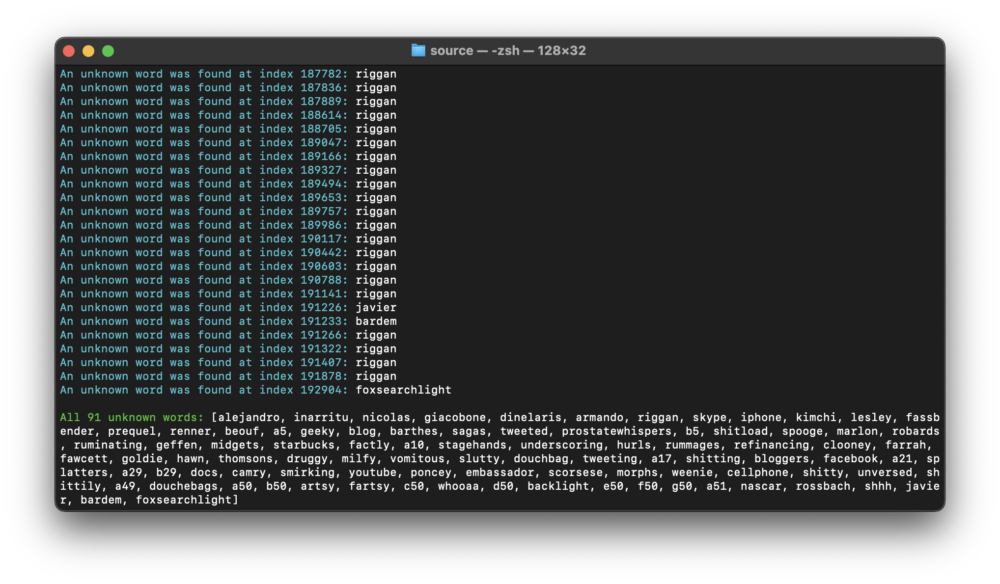

# [Spell-checker](https://github.com/ruancarllo/spell-checker) &middot;  

This small algorithm for spell-checking a text file is an experiment proposed by the [CS50: Introduction to Computer Science](https://pll.harvard.edu/course/cs50-introduction-computer-science) course, adapted to the object-oriented realities of the [Dart](https://dart.dev/) language, based on the idea of a character tree.

## Usage with example files

To test the software execution, open the [source](./source) folder of this project in your terminal and run the following command:

```shell
dart main.dart
```

## Demonstration in terminal

The following image represents the completion of the program execution in a command line:

